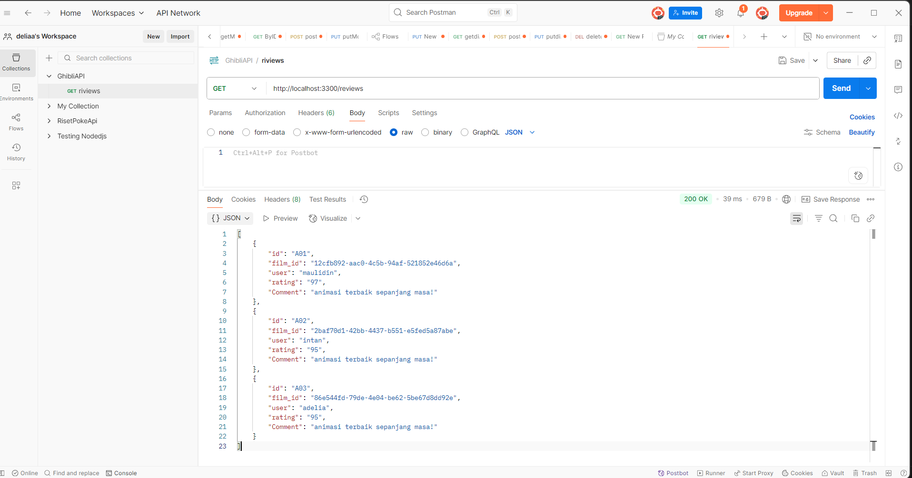
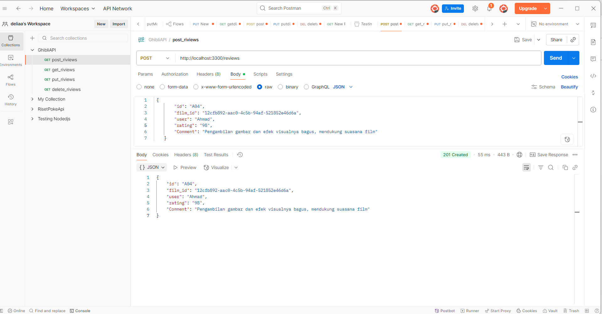
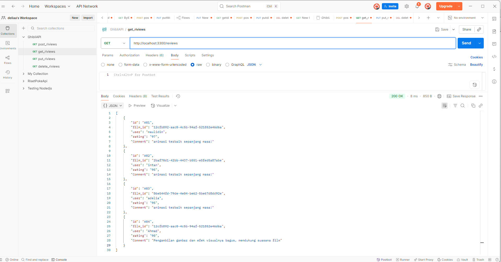
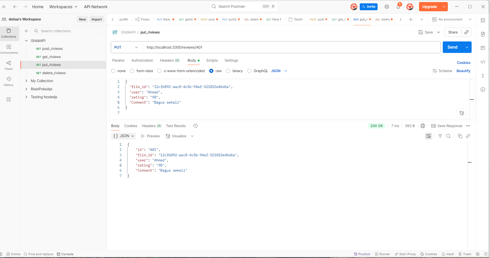
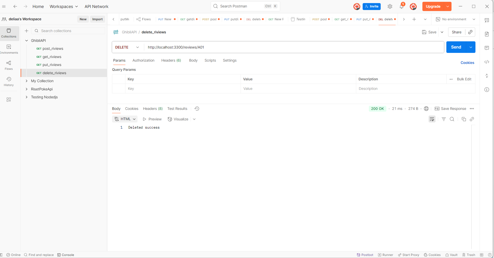
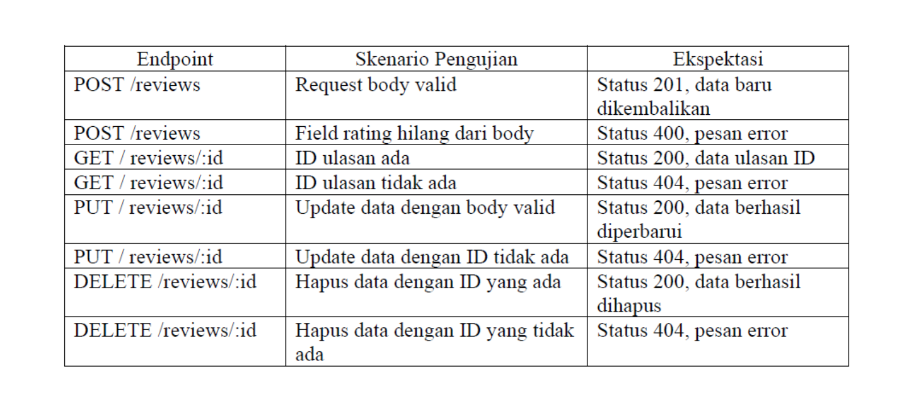

# Proyek API Ulasan Film - Kelompok 9
## Anggota Kelompok
- Ahmad Maulidin (362458302146)
- Intan Rahma Safira (362458302099)
- Adelia fioren zety (362458302124)

## Deskripsi Proyek
API ini adalah layanan internal untuk mengelola ulasan film
dari Studio Ghibli, dengan data film yang direferensikan dari Ghibli API publik.

## Cara Menjalankan Proyek
1. Clone repository ini: ‘git clone https://github.com/Dinn18/Integrasi_API.git ‘
2. Masuk ke direktori: ‘cd Integrasi_API‘
3. Install dependensi: ‘npm install‘
4. Jalankan server: ‘node server.js‘
Server akan berjalan di ‘http://localhost:3300‘.

## Daftar Endpoint
- ‘GET /status‘: Cek status API.
- ‘GET /reviews‘: Mengambil semua ulasan.
- ‘GET /reviews/:id‘: Mengambil ulasan spesifik.
- ‘POST /reviews‘: Membuat ulasan baru.
- ‘PUT /reviews/:id‘: Memperbarui ulasan.
- ‘DELETE /reviews/:id‘: Menghapus ulasan.

## HASIL PENGUJIAN

1. Menunjukkan hasil pengujian endpoint GET /reviews menggunakan Postman.
Endpoint ini mengembalikan data dalam format JSON berisi daftar review film yang mencakup id, film_id, user, rating, dan comment.
Kode Js

[
  {
    "id": "A01",
    "film_id": "12cfb892-aac0-4c5b-94af-521852e46d6a",
    "user": "maulidin",
    "rating": "97",
    "Comment": "animasi terbaik sepanjang masa!"
  },
  {
    "id": "A02",
    "film_id": "2baf70d1-42bb-4437-b551-e5fed5a87abe",
    "user": "intan",
    "rating": "95",
    "Comment": "animasi terbaik sepanjang masa!"
  },
  {
    "id": "A03",
    "film_id": "86e54afd-79de-4e04-be62-5be67d8d92e",
    "user": "adelia",
    "rating": "95",
    "Comment": "animasi terbaik sepanjang masa!"
  }
]

2. Menunjukkan hasil pengujian endpoint POST /reviews menggunakan Postman.
Endpoint ini berfungsi untuk menambahkan review baru ke dalam database.

Pada contoh pengujian, data review yang dikirim adalah:

{
  "id": "A04",
  "film_id": "12cfb892-aac0-4c5b-94af-521852e46d6a",
  "user": "Ahmad",
  "rating": "98",
  "Comment": "Pengambilan gambar dan efek visualnya bagus, mendukung suasana film"
}

Respons yang diterima menunjukkan data berhasil disimpan dengan status 201 Created:

{
  "id": "A04",
  "film_id": "12cfb892-aac0-4c5b-94af-521852e46d6a",
  "user": "Ahmad",
  "rating": "98",
  "Comment": "Pengambilan gambar dan efek visualnya bagus, mendukung suasana film"
}

3. Menunjukkan hasil pengujian endpoint GET /reviews menggunakan Postman.
Endpoint ini digunakan untuk mengambil seluruh data review yang telah tersimpan di database.

Hasil respon berupa array JSON yang berisi beberapa data review, contohnya:

[
  {
    "id": "A01",
    "film_id": "12cfb892-aac0-4c5b-94af-521852e46d6a",
    "user": "maulidin",
    "rating": "97",
    "Comment": "animasi terbaik sepanjang masa!"
  },
  {
    "id": "A02",
    "film_id": "2baf70d1-42bb-4437-b551-e5fed5a87abe",
    "user": "intan",
    "rating": "95",
    "Comment": "animasi terbaik sepanjang masa!"
  },
  {
    "id": "A03",
    "film_id": "86e544fd-79de-4e04-be62-5be67d8d92e",
    "user": "adella",
    "rating": "95",
    "Comment": "animasi terbaik sepanjang masa!"
  },
  {
    "id": "A04",
    "film_id": "12cfb892-aac0-4c5b-94af-521852e46d6a",
    "user": "Ahmad",
    "rating": "98",
    "Comment": "Pengambilan gambar dan efek visualnya bagus, mendukung suasana film"
  }
]

Respon berhasil ditampilkan dengan status 200 OK.

4. Menunjukkan hasil pengujian endpoint PUT /reviews/A01 menggunakan Postman.
Endpoint ini digunakan untuk mengubah data review yang sudah ada berdasarkan id.

Pada pengujian ini, data review dengan id: A01 diperbarui menjadi:

{
  "film_id": "12cfb892-aac0-4c5b-94af-521852e46d6a",
  "user": "Ahmad",
  "rating": "98",
  "Comment": "Bagus sekali"
}

Hasil respon berhasil ditampilkan dengan status 200 OK dan menunjukkan bahwa data review berhasil diperbarui.

5. Menunjukkan hasil pengujian endpoint DELETE /reviews/A01 menggunakan Postman.
Endpoint ini digunakan untuk menghapus data review berdasarkan id.

Pada pengujian ini, review dengan id: A01 berhasil dihapus. Respon yang diterima adalah:

Deleted success

Dengan status 200 OK, menandakan proses penghapusan data berhasil dilakukan.

## TABEL HASIL PENGUJIAN

Berikut adalah tabel skenario pengujian untuk endpoint /reviews beserta ekspektasi hasil respons:
